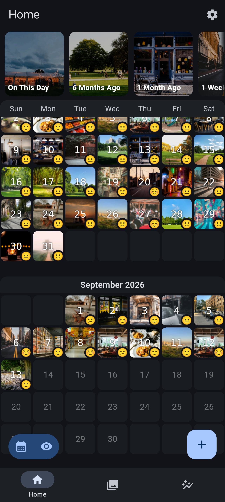
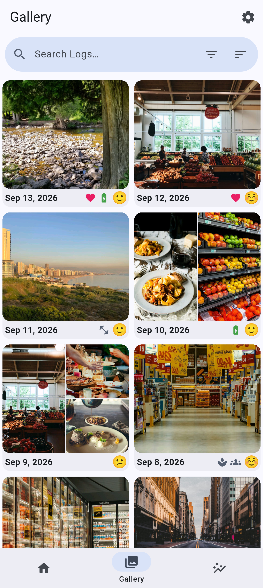
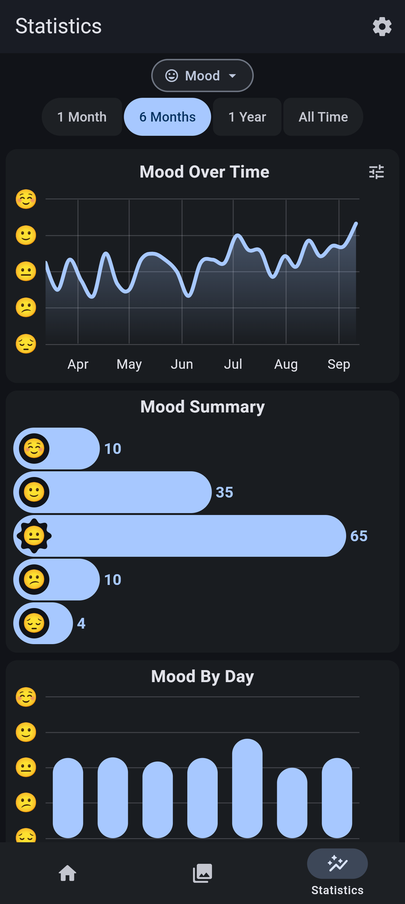
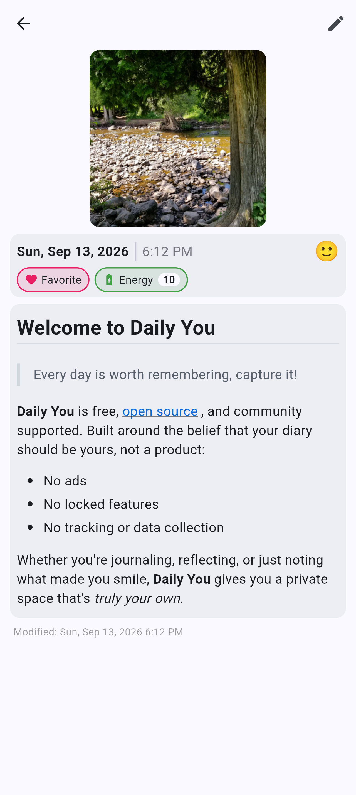

  
# Daily You

**A private, offline-first personal diary and memory journal.**  
_An independent evolution combining the simplicity of Daily You with the rich journaling features of June._

### Every day is worth remembering…

---

Capture the moments that matter. **Daily You** is a standalone, open-source personal journal designed for complete privacy and ownership.

This project is an independent hybrid experience: it takes the rock-solid offline Flutter foundation, encryption, and local storage of **[Daily You by Demizo](https://github.com/Demizo/Daily_You)** and enriches it with the best feature concepts and visual elegance of **[June by DenserMeerkat](https://github.com/DenserMeerkat/June)** including rich media links, interactive map previews, smart people tagging, and personalized spaces.

No accounts, no ads, no trackers, and no subscription paywalls your journal belongs to you.

## ✨ What's New in this Edition

Building upon the original Daily You foundation, this release introduces major new features inspired by June while keeping both apps completely distinct:

- 🎵 **Music & Media Links:** Add songs directly from YouTube Music, YouTube, and share links. Features automatic multi-source metadata resolution (title, artist, album, square cover art) with fallback support, cached offline covers, and playable 30-second audio previews right on your entry cards.
- 📍 **Interactive Location & Visual Map Previews:** Pin where you were with one-tap native GPS auto-fetch and address reverse-geocoding. Entries feature live interactive map tile previews, with an elegant offline blueprint grid view when network access is disabled.
- 👥 **Dedicated People Tagging (`@person`):** Track the people who matter most without cluttering your tag catalog. Enjoy smart `@name` autocomplete right from the editor toolbar and browse dedicated entries per person.
- 🗂️ **Custom Spaces:** Organize entries by areas of life, work, or travel. Spaces are created purely on demand by you, keeping your normal journal entries clean and uncluttered.
- 🏷️ **Native Independent Tags:** Daily You's tag system (labels, trackers, icons, and colors) remains completely independent and unconstrained by rigid prefixes.
- 🎬 **Video Attachments:** Full video capture, thumbnail previews, and in-app video playback alongside your photo gallery.
- 🛡️ **Master Network Switch:** Complete peace of mind with a global kill-switch. When off, zero internet requests are made and all offline fallbacks engage automatically.
- 🔒 **Screen & Recents Protection:** Hardware-level screenshot blocking and recents thumbnail hiding via Android's `FLAG_SECURE`.
- 🔑 **Security Question PIN Recovery:** Safe local recovery method if you ever forget your entry PIN.
- 📦 **Comprehensive Encrypted Backups:** Full AES-GCM encrypted ZIP backup and restore covering all entries, tags, photos, videos, cached song covers, spaces, and people.

---

## 🌟 Core Features

✍️ **Take daily logs:** Journal your thoughts, reflections, or daily routines.

📈 **Track your mood:** Gain insight into how your emotions change over time with analytics.

🖼️ **Keep photo memories:** Add multiple pictures to enrich your memories.

📝 **Rich note taking:** Format notes your own way with Markdown.

🔔 **Gentle reminders:** Flexible reminders with custom schedules to keep you consistent.

🔒 **Control your data:** Choose where your data lives, including internal or external storage.

🌐 **Offline-first:** Works without internet. Always.

---

## 📱 Download & Installation

Download the latest signed release APK from the [Releases](https://github.com/TraxDinosaur/DailyYou/releases) page.

1. Download `app-fdroid-release.apk` to your device.
2. Open your device file manager and tap the APK file.
3. Allow "Install unknown apps" if prompted.
4. Tap **Install** and enjoy **Daily You**.

---

## 🔄 Migrate From Another App

Are you coming from another journaling app? **Daily You** supports importing from other popular apps. Go to `Settings > Backup & Restore > Import From Another App` and select your previous app.

---

## 🤝 Credits & Attribution

This standalone project is maintained by **[TraxDinosaur](https://github.com/TraxDinosaur)** and is built upon the incredible work of the open-source community:

- **[Daily You](https://github.com/Demizo/Daily_You)** by [Demizo](https://github.com/Demizo) (GPL-3.0) : The foundational diary engine, architecture, and database model.
- **[June](https://github.com/DenserMeerkat/June)** by [DenserMeerkat](https://github.com/DenserMeerkat) (GPL-3.0) : Feature design, UX workflows, and behavioral inspirations for media links, map previews, people tagging, and spaces.

---

## 📄 License

This software is free software licensed under the **GNU General Public License 3.0** (GPL-3.0). See [LICENSE.txt](LICENSE.txt) for details.
